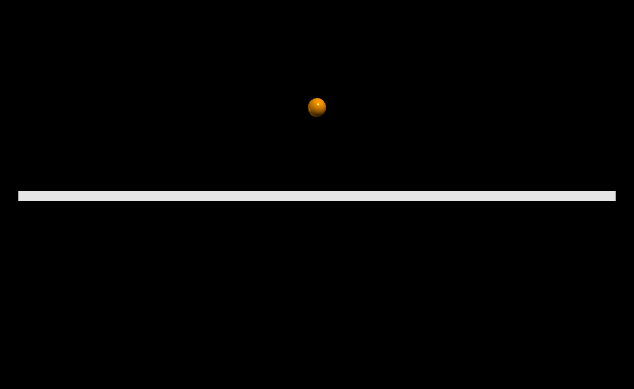
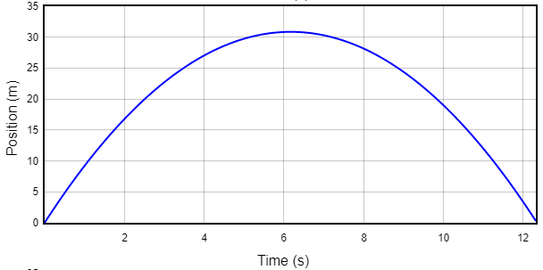
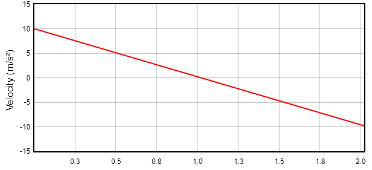

# MATRIX MANIPULATION

 

<h1>APRESENTAÇÃO 💡</h1>

Neste trabalho, cada aluno deve implementar e simular algum experimento físico. Para este, escolhi fazer o movimento vertical.

 

<h1>INTRODUÇÃO 📌</h1>

O lançamento vertical é um movimento unidimensional no qual se desconsidera o <b>atrito com o ar</b>. Esse tipo de movimento ocorre quando um corpo é lançado na direção vertical e para cima. O movimento descrito pelo projétil é retardado pela aceleração da gravidade até que ele atinja a sua altura máxima. Após essa altura, o movimento passa a ser descrito como uma queda livre. 

 
<h1>FUNCIONAMENTO 📄</h1>

<h2>FORMULÁRIO 📐</h2>

As leis que explicam o movimento dos corpos que sem movem na direção vertical foram descobertas e enunciadas pelo físico italiano Galileu Galileu. Na ocasião, Galileu percebeu que corpos de massas diferentes devem cair com o mesmo tempo e com aceleração constante em direção ao solo. Essa situação só não será possível caso a força de resistência do ar atue sobre esses corpos, dissipando sua velocidade.

O lançamento vertical é um caso particular de movimento uniformemente variado (MUV), já que ocorre sob a ação de uma aceleração constante. Nesse caso, a aceleração da gravidade opõe-se à velocidade de lançamento do projétil, que tem sentido positivo.

As equações que regem esse tipo de movimento são as mesmas utilizadas para os casos gerais do MUV, sujeitas a pequenas alterações de notação. Confira:

<i>Figura 1: Fórmulas utilizadas para os cálculos na simulação.</i>

Nas equações acima, '<b>Vy</b>' é a altura final atingida pelo projétil para um dado instante de tempo '<b>t</b>'. A velocidade inicial '<b>V0y</b>' é a velocidade com que o projétil é lançado, podendo ser positiva, caso o lançamento seja para cima, ou negativa, caso o lançamento seja para baixo, ou seja, a favor da gravidade. As alturas final e inicial do lançamento são chamadas, respectivamente, de '<b>y</b>' e '<b>y0</b>'. Por fim, '<b>g</b>' é a aceleração da gravidade no local do lançamento.

<h2>COLETA DE DADOS 📝</h2>

O punico tipo de entrada de dados acessíveis pelo usuáro são as condição iniciais do corpo. O uusário tem o poder de alterar: a massa do corpo (<b>Kg</b>) e a velocidade inicial (<b>m/s²</b>).

Assim que os dados são coletados, basta clicar em <strong>EXECUTAR</strong> no canto superior direito da tela do <i>Jupter.Notebook</i>. O programa, durante a execução do mesmo, é capaz de gerar 3 gráficos que relacionam respectivamente :   <strong>↳ TEMPO x POSIÇÃO;  ↳ POSIÇÃO x VELOCIDADE; ↳ VELOCIDADE x TEMPO</strong>.

 
<h1>REPRESENTAÇÃO GRÁFICA 📈</h1>

O exemplo que será apresentado aqui, utilizará as seguintes configurações: 10kg de massa do corpo que saíra do repouso a 10m/s².  

Para essas configurações iniciais, o programa deve progredir da seguinte maneira:
 

<i>Figura 2: Exemplo de saída do programa enquanto a bolinha sai do repouso.</i>

E gerar os seguintes gráficos: 

<ul>
    <li>➢ 

        
        
<i>Figura 3: Exemplo de saída do programa de um dos gráficos.</i>

        

    </li>

<li>➢ 

    
    
<i>Figura 3: Exemplo de saída do programa de um dos gráficos.</i>

    

</li>

</ul>

 
<h1>AUTOR</h1>
Criado por Henrique Souza Fagundes;

Aluno do 4° periodo do curso de `Engenharia da Computação` no [CEFET-MG](https://www.cefetmg.br)
